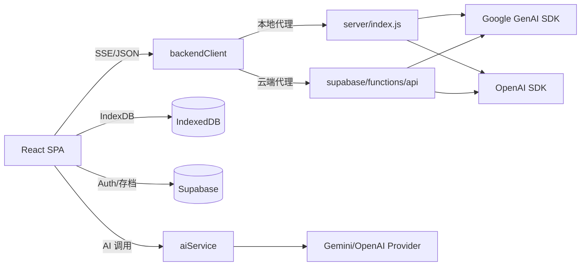
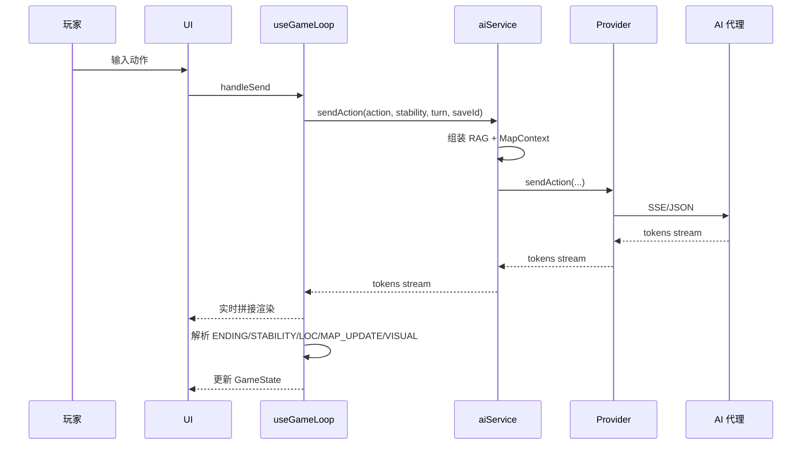
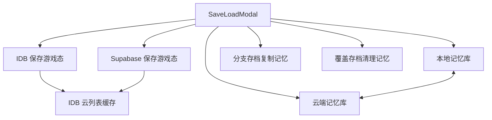

# SCP Entry: Loom of Fate 架构设计文档

## 1. 项目概述
SCP Entry: Loom of Fate 是以 React 19 + Vite 6 + TypeScript 构建的单页应用，AI 叙事通过 SSE 流式输出驱动前端状态机。系统包含本地 Node AI 代理与 Supabase Edge Function 两套后端形态，存档采用 IndexedDB 本地持久化并与 Supabase 云端同步，回合中以地图上下文约束与记忆检索（RAG）注入保持叙事一致性。

---

## 2. 系统上下文（System Context）
- 玩家（浏览器端）与 UI：React SPA。入口链路为 [index.html](index.html) → [index.tsx](index.tsx) → [App.tsx](App.tsx)，由 `GameStatus` 状态机切换 Start / Tactical Preview / Story Editor / Game / Game Over。  
- AI 叙事引擎：Prompt 规则与标签协议集中在 [prompts.ts](services/ai/prompts.ts)，服务门面为 [aiService.ts](services/aiService.ts)，Provider 实现为 Gemini/OpenAI。  
- AI 接入拓扑：前端通过 [backendClient.ts](services/ai/providers/backendClient.ts) 调用本地 Node 代理 [server/index.js](server/index.js) 或 Supabase Edge Function [supabase/functions/api/index.ts](supabase/functions/api/index.ts)。  
- 存储层：本地 IndexedDB + 云端 Supabase 存档协作由 [SaveLoadModal.tsx](components/SaveLoadModal.tsx) 触发，并包含云列表缓存与记忆数据镜像。  
- 记忆检索（RAG）：按 `timelineId(saveId)` 检索本地记忆并注入模型上下文，由 [aiService.ts](services/aiService.ts) 管理。  
- 音视频系统：稳定性触发的视效由 [StabilityMonitor.tsx](components/game/StabilityMonitor.tsx) 与 [VisualEffects.tsx](components/game/VisualEffects.tsx) 协作驱动；BGM/SFX 静态资源位于 [public/bgm](public/bgm) 与 [public/sfx](public/sfx)。  
- 主题系统：全局主题色、字体与 CSS 变量由 [index.html](index.html) 定义，运行时动态改写。

---

## 3. 关键图表

### 3.1 系统拓扑与主要依赖

### 3.2 回合流式处理与标签解析

### 3.3 存档与记忆同步

---

## 4. 运行时主流程（End-to-End）
### 4.1 开局流
- 玩家在 [StartScreen.tsx](components/StartScreen.tsx) 输入 SCP 与角色，进入 Entity Profile → Tactical Preview。  
- 通过 `analyzeSCPUrl` 生成 SCPData（含 mapBlueprint 与视觉描述），随后可能进入 Story Editor 做蓝图编辑。  
- `startGameProcess` 在 [gameStart.ts](utils/gameStart.ts) 触发 `initializeGameChatStream`，首包到达即切换到 PLAYING，并初始化 runtime map/NPC/任务/库存与首条叙事消息。  
- 根据设置并行生成背景图、实体图与 NPC 图；如首段包含 VISUAL 标签则生成场景图。

### 4.2 回合流
- 玩家输入由 [useGameLoop.ts](hooks/useGameLoop.ts) 触发 `sendAction` 流式请求。  
- `sendAction` 在 [aiService.ts](services/aiService.ts) 组装 RAG 记忆与地图上下文，交由 Provider 调用后端代理并流式返回。  
- 前端持续拼接并实时渲染，结束后依次解析：
  - [ENDING]：结局判定  
  - [STABILITY]：稳定性变更  
  - [LOC]：更新地图当前位置  
  - [MAP_UPDATE]：NPC/任务/门禁与库存更新（[useMapUpdate.ts](hooks/useMapUpdate.ts)）  
  - [VISUAL]：触发场景插图生成  
- 地图强约束上下文由 [useMapContext.ts](hooks/useMapContext.ts) 构建，要求移动成功时输出 `[LOC: node_id]`。  
- 稳定性驱动视觉与音频异常见 [StabilityMonitor.tsx](components/game/StabilityMonitor.tsx) 与 [VisualEffects.tsx](components/game/VisualEffects.tsx)。

### 4.3 结局流与回顾
- 结局判定后进入 GAME_OVER，GameScreen 展示总结与后续入口。  
- [WorldLineTree.tsx](components/WorldLineTree.tsx) 负责生成事后报告、问答回响、PDF 导出、New Game+ 遗产选择。  
- 评估报告与统计视图在 [GameReviewReport.tsx](components/GameReviewReport.tsx)。

---

## 5. 模块分层与职责

### 5.1 UI/交互层
- **应用壳与状态机**：GameStatus 驱动页面切换。[App.tsx](App.tsx)  
- **开局界面**：角色选择、输入、随机 SCP、设置与读档入口。[StartScreen.tsx](components/StartScreen.tsx)  
- **战术预览**：开局前预览/编辑参数。[TacticalPreview.tsx](components/TacticalPreview.tsx)  
- **故事编辑器**：编辑 SCPData 与地图蓝图。[StoryEditor.tsx](components/editor/StoryEditor.tsx)  
- **游戏主屏**：回合循环、消息流、稳定性、图像生成控制、存档入口。[GameScreen.tsx](components/GameScreen.tsx)  
- **世界线树**：回合回放、AAR、Q&A、导出与 New Game+。[WorldLineTree.tsx](components/WorldLineTree.tsx)  
- **地图面板**：图结构布局与邻接判断、门禁与目标状态提示。[MapPanel.tsx](components/game/MapPanel.tsx)  
- **侧栏容器**：左右滑出式固定面板布局。[SidePanel.tsx](components/common/SidePanel.tsx)

### 5.2 AI/规则层
- **Prompt 与协议**：输出格式、稳定性规则、结局判定、地图机制统一定义。[prompts.ts](services/ai/prompts.ts)  
- **服务门面与 Provider**：统一入口与实现切换。[aiService.ts](services/aiService.ts) [types.ts](services/ai/types.ts)

### 5.3 视觉与音效层
- **稳定性驱动的视觉干扰**：闪烁、干扰、记忆回响、色彩错位。[VisualEffects.tsx](components/game/VisualEffects.tsx)  
- **稳定性监控组件**：波形、相位与临界音效触发。[StabilityMonitor.tsx](components/game/StabilityMonitor.tsx)

### 5.4 存储与同步层
- **本地/云存档交互**：本地 IndexedDB + 云存档（含登录、同步、冲突处理与云列表缓存）。[SaveLoadModal.tsx](components/SaveLoadModal.tsx)

### 5.5 编辑器与草稿层
- **编辑器持久化**：草稿与编辑缓存落地 IndexedDB。[indexedDBService.ts](services/indexedDBService.ts) [storyEditorCache.ts](services/storyEditorCache.ts)

### 5.6 i18n 层
- 轻量语言 Provider + 持久化 + 角色名翻译入口。[provider.tsx](utils/i18n/provider.tsx) [persistence.ts](utils/i18n/persistence.ts) [i18n/index.ts](utils/i18n/index.ts)

### 5.7 主题与样式层
- Tailwind 扩展、色板与 CSS 变量：统一为 SCP 视觉风格提供基色与特效。  
  入口：[index.html](index.html)

---

## 6. 关键数据模型（概念）
- **GameState**（全局）：包含状态机、messages、stability、map、npcs、objectives、inventory、legacy 等。权威定义见 [types.ts](types.ts)。  
- **SCPData**：由开局分析产生，包含 `designation/name/containmentClass` 与 `mapBlueprint` 等。由 [StartScreen.tsx](components/StartScreen.tsx) 使用。  
- **MapBlueprint + Runtime Map**：蓝图为静态节点/边/门禁与任务配置；运行态记录当前节点与已发现集合。[MapPanel.tsx](components/game/MapPanel.tsx)  
- **消息流**：narrator/user 交替，narrator 带 stabilitySnapshot 与可选 imageUrl。[GameScreen.tsx](components/GameScreen.tsx)

---

## 7. 核心业务机制

### 7.1 休谟场稳定性（Hume Stability）
- 定义、阶段与系统标签规则由 [prompts.ts](services/ai/prompts.ts) 约束。  
- UI 侧将稳定性映射为主题色与视觉干扰强度：[GameScreen.tsx](components/GameScreen.tsx) [StabilityMonitor.tsx](components/game/StabilityMonitor.tsx) [VisualEffects.tsx](components/game/VisualEffects.tsx)

### 7.2 地图与任务系统
- AI 生成地图蓝图（nodes/edges/npcs/objectives）由 Prompt 规则约束。[prompts.ts](services/ai/prompts.ts)  
- 运行态的门禁、邻接、NPC 分布与任务进度渲染在 [MapPanel.tsx](components/game/MapPanel.tsx)  
- 地图上下文与门禁约束由 [useMapContext.ts](hooks/useMapContext.ts) 注入

### 7.3 记忆检索（RAG）
- 每回合按 `timelineId(saveId)` 检索记忆 embedding，并注入模型上下文。[aiService.ts](services/aiService.ts)  
- 记忆命中时触发 `[MEMORY_ACTIVE]` 前端效果。[useGameLoop.ts](hooks/useGameLoop.ts)

### 7.4 事后报告与导出
- 回合统计、稳定性曲线、AAR 结构渲染见 [GameReviewReport.tsx](components/GameReviewReport.tsx)。  
- PDF 导出与世界线回溯编排见 [WorldLineTree.tsx](components/WorldLineTree.tsx)。

---

## 8. 存档与同步策略
- 本地与云存档由 [SaveLoadModal.tsx](components/SaveLoadModal.tsx) 统一入口，支持：  
  - 本地读写  
  - 云端登录/同步  
  - 时间戳冲突处理  
  - IndexedDB 缓存云列表  
- 记忆数据与存档绑定 `timelineId(saveId)`：  
  - 覆盖保存时清理旧 timeline 的记忆  
  - 分支保存时复制旧 timeline 的记忆  
  - 云端与本地记忆镜像互同步  
- i18n 语言偏好持久化为设置项，详见 [persistence.ts](utils/i18n/persistence.ts)。

---

## 9. 主题系统与音频资产
- **主题**：全局色板、字体与动画由 [index.html](index.html) 定义，运行时根据稳定性动态更新 accent 变量（由 GameScreen 注入到 CSS 变量）。  
- **音频**：BGM 与 SFX 资源位于 [public/bgm](public/bgm) 与 [public/sfx](public/sfx)，并由稳定性监控与反馈系统触发播放节奏（UI 侧见 [StabilityMonitor.tsx](components/game/StabilityMonitor.tsx))。

---

## 10. 国际化（i18n）
- 轻量 Context + 字典树查找 + 参数插值；语言在 IndexedDB 中持久化。  
- 入口与实现：[i18n/index.ts](utils/i18n/index.ts) [provider.tsx](utils/i18n/provider.tsx) [persistence.ts](utils/i18n/persistence.ts)
