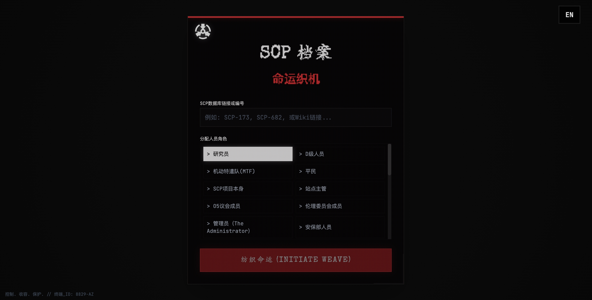

# SCP档案: 命运织机 (SCP Entry: Loom of Fate)

> **控制 (SECURE). 收容 (CONTAIN). 保护 (PROTECT).**

**SCP Entry: 命运织机** 是一款基于 SCP 基金会宇宙观的沉浸式生成式文字冒险游戏。由 Google **Gemini 2.5** 模型驱动，它能够根据你输入的任意 SCP 编号，实时生成独一无二的非线性叙事体验。

透过复古未来的终端界面，体验基金会的恐惧、神秘与冷酷的科学风格。


## 立即体验

[SCP Entry: Loom of Fate](https://ai.studio/apps/drive/1u4Gc2F84hVihQGYAxOxXrwqHJhMacJ2l)



## 🎮 游戏特色

*   **无限流叙事生成**: 输入任意 SCP 编号（如 SCP-173, SCP-682）或 Wiki 链接。AI 将分析官方档案，生成独特的收容失效或探索剧本。
*   **多视角角色扮演**: 扮演研究员、D级人员、机动特遣队(MTF)成员，甚至扮演 SCP 项目本身。剧情将根据你的权限等级和视角动态调整。
*   **休谟场稳定性机制 (Hume Field Stability)**: 监控当前现实维度的稳定性。低稳定性将触发视觉幻觉、音频异常，最终导致“现实崩溃”和屏幕破碎。
*   **沉浸式终端 UI**: CRT 扫描线、粒子文字特效、故障艺术 (Glitch Art) 风格以及动态破碎效果，营造紧张的科幻恐怖氛围。
*   **实时图像生成**: 利用 Gemini 的多模态能力，实时生成符合当前氛围的背景环境图和异常实体视觉记录。
*   **世界线因果图谱**: 游戏结束后，查看基于你选择的分支时间线，并将生成的《事故报告》导出为 PDF 格式。
*   **双语支持**: 完美支持中文和英文界面及剧情生成。

## 🚀 快速开始

### 前置要求

*   已安装 Node.js 环境。
*   有效的 Google Gemini API Key。

### 安装步骤

1.  **克隆仓库**
    ```bash
    git clone https://github.com/yourusername/scp-loom-of-fate.git
    cd scp-loom-of-fate
    ```

2.  **安装依赖**
    ```bash
    npm install
    ```

3.  **配置 API Key**
    *   在根目录创建 `.env` 文件。
    *   添加你的 Google GenAI API Key:
        ```env
        API_KEY=your_google_api_key_here
        ```
    *   *注: Web 演示版本支持在 UI 中通过安全弹窗输入 Key。*

4.  **运行应用**
    ```bash
    npm start
    ```
    打开浏览器访问 [http://localhost:3000](http://localhost:3000)。

## 🕹️ 玩法指南

1.  **初始化**: 在终端输入目标 SCP 编号（例如 "SCP-096"）。
2.  **分配角色**: 选择你的角色原型（如“研究员”、“机动特遣队”）。
3.  **启动编织**: 点击开始。系统将检索档案并生成初始场景。
4.  **生存**: 输入你的行动指令或选择建议选项。时刻关注左上角的 **稳定性 (Stability)** 读数。
5.  **结局**: 尝试达成“收容重建”、“逃离”或“存活”结局。小心稳定性归零导致的 **现实崩溃**。

---