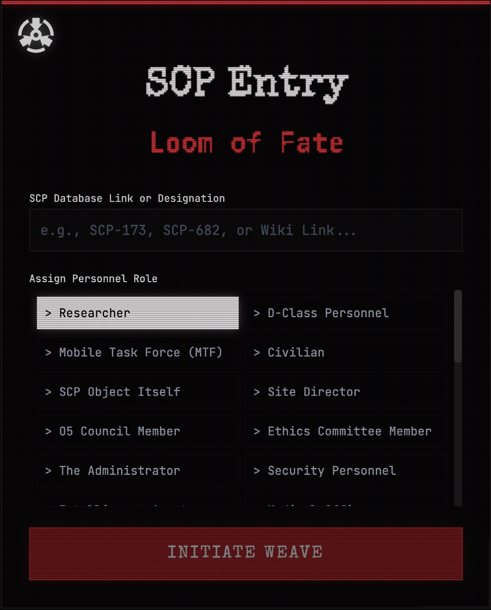

[English Version](README.md)

# SCP档案: 命运织机 (SCP Entry: Loom of Fate)

> **控制 (SECURE). 收容 (CONTAIN). 保护 (PROTECT).**

**SCP Entry: 命运织机** 是一款基于 SCP 基金会宇宙观的沉浸式生成式文字冒险游戏。由 Google **Gemini** 模型驱动，它能够根据你输入的任意 SCP 编号，实时分析档案并生成独一无二的非线性叙事体验。

透过复古未来的终端界面，体验基金会的恐惧、神秘与冷酷的科学风格。


## 🎮 游戏特色

*   **无限流叙事生成**: 输入任意 SCP 编号（如 SCP-173, SCP-682）或 Wiki 链接。AI 将实时检索并分析官方档案，生成独特的收容失效或探索剧本。
*   **多视角角色扮演**: 扮演研究员、D级人员、机动特遣队(MTF)、站点主管，甚至扮演现实扭曲者或 SCP 项目本身。剧情将根据你的视角动态调整。
*   **交互式选项集成**: 通过键入行动指令或直接点击叙事文本中的编号选项、SCP 编号来快速推进剧情。
*   **休谟场稳定性机制 (Stability)**: 监控当前现实维度的稳定性。低稳定性将触发视觉幻觉、色彩偏移故障艺术 (Glitch Art)、警报音效，最终导致“现实崩溃”。
*   **深度行动后报告 (AAR)**: 游戏结束后生成详细评估，包括操作等级（S-F）、量化评分、心理侧写以及来自 GOC、蛇之手等不同阵营的评价。
*   **自由质询环节**: 利用剩余的神经链接，在游戏结束后向 AI 主持人提出最多 3 个关于本次故事细节或隐藏设定。
*   **档案导出**: 将完整的冒险历程、休谟场趋势图和表现评估导出为排版精美的 PDF 格式《官方事故报告》。
*   **沉浸式感官反馈**: 包含 CRT 扫描线、交互式粒子文字特效、程序化音频报警以及随稳定性下降而加剧的动态屏幕破碎效果。
*   **双语支持**: 完美支持中文和英文界面及剧情生成。
*   **云端存档与同步**: 支持 Google 账号一键登录，通过 Supabase 实现存档的云端加密存储。具备自动后台同步、IndexedDB 本地缓存（离线支持）以及跨设备进度共享功能。

## 立即体验

[SCP Entry: Loom of Fate](https://ai.studio/apps/drive/1u4Gc2F84hVihQGYAxOxXrwqHJhMacJ2l)



## 🚀 快速开始

### 前置要求

*   已安装 Node.js 环境。
*   有效的 Google Gemini API Key。

### 安装步骤

1.  **克隆仓库**
    ```bash
    git clone https://github.com/yourusername/scp-loom-of-fate.git
    cd scp-loom-of-fate
    ```

2.  **安装依赖**
    ```bash
    npm install
    ```

3.  **配置 API Key**
    *   在根目录创建 `.env` 文件。
    *   添加你的 Google GenAI API Key:
        ```env
        GEMINI_API_KEY=your_google_api_key_here
        # 可选：Supabase 配置（演示版本已包含默认配置）
        # VITE_SUPABASE_URL=your_supabase_project_url
        # VITE_SUPABASE_ANON_KEY=your_supabase_anon_key
        ```
    *   *注: Web 演示版本支持在 UI 中通过安全弹窗输入 Gemini Key。云存档功能已预置 Supabase 配置，您也可以替换为您自己的项目配置。*

4.  **运行应用**
    ```bash
    npm start
    ```
    打开浏览器访问 [http://localhost:3000](http://localhost:3000)。

## 🕹️ 玩法指南

1.  **初始化**: 在终端输入目标 SCP 编号（如 "SCP-096"），或点击输入框右侧的 **随机按钮** 从数据库中抽取。
2.  **分配角色**: 从角色矩阵中选择你的原型。
3.  **启动编织**: 点击开始。系统将检索档案、生成背景氛围图并开启叙事。
4.  **存档/读取**: 随时通过菜单保存进度或同步至云端（需登录）。
5.  **生存**: 输入行动或点击建议选项。时刻关注左上角的 **稳定性 (Stability)** 读数，鲁莽的举动会撕裂现实。
6.  **复盘**: 达成结局后，生成 **AAR 报告** 查看表现评分，并可进行自由提问以解开故事谜团。
7.  **归档**: 点击 **导出档案 (PDF)**，为基金会档案库留下你的独特记录。
