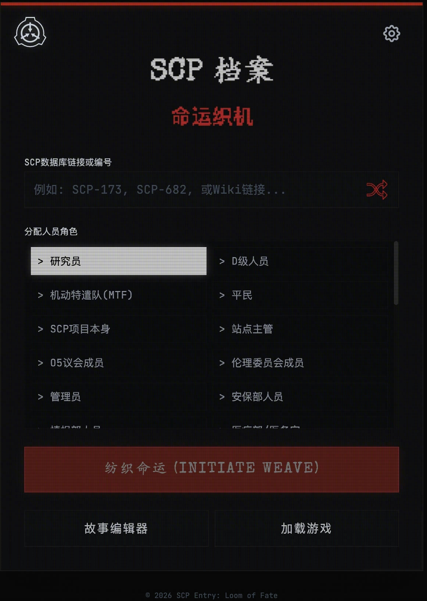

[English Version](README.md)

# SCP档案: 命运织机 (SCP Entry: Loom of Fate)

> **控制 (SECURE). 收容 (CONTAIN). 保护 (PROTECT).**

**SCP Entry: 命运织机** 是一款基于 SCP 基金会宇宙观的沉浸式生成式文字冒险游戏。由 Google **Gemini** 模型驱动，它能够根据你输入的任意 SCP 编号，实时分析档案并生成独一无二的非线性叙事体验。

透过复古未来的终端界面，体验基金会的恐惧、神秘与冷酷的科学风格。


## 许可协议

本项目采用 **Creative Commons Attribution-ShareAlike 3.0 Unported（CC BY-SA 3.0）** 许可协议。详见 [LICENSE](LICENSE)。

## 🎮 游戏特色

*   **无限流叙事生成**: 输入任意 SCP 编号（如 SCP-173, SCP-682）或 Wiki 链接。AI 将实时检索并分析官方档案，生成独特的收容失效或探索剧本。
*   **多视角角色扮演**: 扮演研究员、D级人员、机动特遣队(MTF)、站点主管，甚至扮演现实扭曲者或 SCP 项目本身。剧情将根据你的视角动态调整。
*   **实体档案增强（角色画像）**: 在任务开始前生成角色画像，用于锁定口吻、背景与叙事约束。
*   **战术预览与准备**: 在踏入未知区域前，先预览 AI 生成的开局态势图，确认你的起始位置、周边威胁与任务目标，做最后的战术调整。
*   **故事编辑器与智能助手**: 化身"世界建筑师"，亲手绘制任意地图布局——放置节点、设置连边与门禁、配置 NPC 属性（身份、初始位置、对话目标）、设计任务链。内置 AI 助手可协助你快速构建：只需输入自然语言（如"生成一个包含收容室和武器库的地下掩体"），助手即会自动调用工具完成地图搭建。
*   **交互式选项集成**: 通过键入行动指令或直接点击叙事文本中的编号选项、SCP 编号来快速推进剧情。
*   **地图与任务系统**: 在动态节点图上移动，遵守邻接规则与门禁权限。NPC 拥有独立属性与交互目标，任务目标会随剧情推进更新或完成。
*   **休谟场稳定性机制 (Stability)**: 监控当前现实维度的稳定性。低稳定性将触发视觉幻觉、色彩偏移故障艺术 (Glitch Art)、警报音效，最终导致“现实崩溃”。
*   **多周目遗产与回响（New Game+）**: 通关后，你的角色会留下"特质"（如"冷静"或"创伤后应激"）、"物品"（如"加密门禁卡"）和"世界回响"（如"上次在这里发生了某事"）。开启新周目时可选择继承最多 5 项特质与物品，并在关键节点触发额外对白与彩蛋。
*   **深度行动后报告 (AAR)**: 游戏结束后生成详细评估，包括操作等级（S-F）、量化评分、心理侧写以及来自 GOC、蛇之手等不同阵营的评价。
*   **自由质询环节**: 利用剩余的神经链接，在游戏结束后向 AI 主持人提出最多 3 个关于本次故事细节或隐藏设定。
*   **档案导出**: 将完整的冒险历程、休谟场趋势图和表现评估导出为排版精美的 PDF 格式《官方事故报告》。
*   **沉浸式感官反馈**: 包含 CRT 扫描线、交互式粒子文字特效、程序化音频报警以及随稳定性下降而加剧的动态屏幕破碎效果。
*   **双语支持**: 完美支持中文和英文界面及剧情生成。
*   **云端存档与同步**: 支持 Google 账号一键登录，通过 Supabase 实现存档的云端加密存储。具备自动后台同步、IndexedDB 本地缓存（离线支持）以及跨设备进度共享功能。

## 立即体验

[SCP Entry: Loom of Fate](https://ai.studio/apps/drive/1u4Gc2F84hVihQGYAxOxXrwqHJhMacJ2l)



## 🚀 快速开始

### 前置要求

*   已安装 Node.js 环境。
*   建议准备一个 Supabase 项目：用于云存档与 Edge Function API。
*   任一 AI Key（两种使用方式二选一）：
    *   本地运行：在应用内的 AI 设置里填写（推荐）。
    *   部署环境：配置到 Supabase Edge Function 的 secrets（推荐）。

### 安装步骤

1.  **克隆仓库**
    ```bash
    git clone https://github.com/yourusername/scp-loom-of-fate.git
    cd scp-loom-of-fate
    ```

2.  **安装依赖**
    ```bash
    npm install
    ```

3.  **配置 API Key**
    *   在根目录创建 `.env` 文件。
    *   推荐从示例文件开始：
        ```bash
        cp .env.example .env
        ```
        ```env
        # Supabase（云存档 + Edge Function API）
        VITE_SUPABASE_URL=https://your-project.supabase.co
        VITE_SUPABASE_ANON_KEY=your_supabase_anon_key

        # Supabase Edge Function 基地址（AI API）
        # 应用会请求 `${VITE_AI_SERVER_URL}/api/...`
        VITE_AI_SERVER_URL=https://your-project.supabase.co/functions/v1/api

        # 可选：请求签名（仅当 Edge Function 启用校验时设置）
        # VITE_SIGNING_SECRET=your_signing_secret
        ```
    *   AI Key：
        *   本地运行最简单：直接在应用内 AI 设置里填写 Key。
        *   部署环境：将 Key 配到 Supabase function secrets（例如 `GEMINI_API_KEY`、`OPENAI_API_KEY`、`OPENAI_BASE_URL`）。
    *   云存档：按 [SUPABASE_SETUP.md](SUPABASE_SETUP.md) 完成 Google OAuth 与数据库表/RLS 配置。
    *   Supabase Edge Function（自建部署）：
        ```bash
        supabase functions deploy api
        supabase secrets set GEMINI_API_KEY=... OPENAI_API_KEY=... OPENAI_BASE_URL=...
        ```

4.  **运行应用**
    ```bash
    npm run dev
    ```
    打开浏览器访问 [http://localhost:3000](http://localhost:3000)。

### 本地后端替代方案（可选）

如果你希望完全本地部署（不走 Supabase Edge Function），可以使用仓库自带的本地 AI 代理服务。

1.  **切换 AI API 到本地代理**
    ```env
    VITE_AI_SERVER_URL=http://127.0.0.1:5174
    ```
2.  **一键启动本地后端 + 前端**
    ```bash
    npm run dev:legacy
    ```

## 🕹️ 玩法指南

1.  **初始化**: 在终端输入目标 SCP 编号（如 "SCP-096"），或点击输入框右侧的 **随机按钮** 从数据库中抽取。
2.  **分配角色**: 从角色矩阵中选择你的原型。
3.  **画像与准备**: 确认角色画像并完成战术预览；如需自定义地图，可进入故事编辑器调整蓝图。
4.  **启动编织**: 点击开始。系统将检索档案、生成背景氛围图并开启叙事。
5.  **存档/加载**: 随时通过菜单保存进度或同步至云端（需登录）。
6.  **生存**: 输入行动或点击建议选项。时刻关注左上角的 **稳定性 (Stability)** 读数，鲁莽的举动会撕裂现实。
7.  **复盘**: 达成结局后，生成 **AAR 报告** 查看表现评分，并可进行自由提问以解开故事谜团。
8.  **归档**: 点击 **导出档案 (PDF)**，为基金会档案库留下你的独特记录。

## 开发者信息

*   架构文档：[ARCHITECTURE.md](ARCHITECTURE.md)
*   测试：
    ```bash
    npm test
    ```
